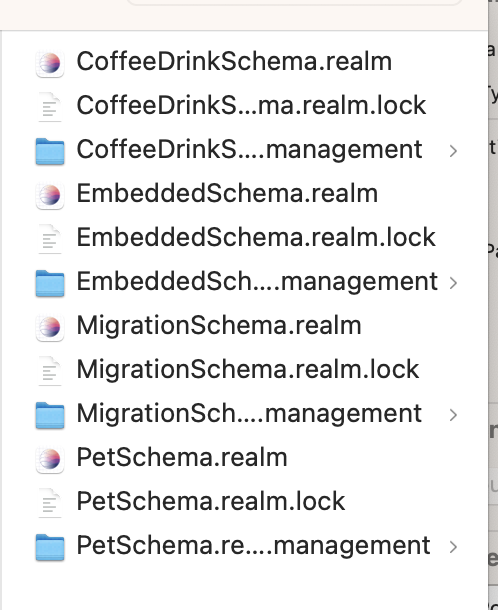
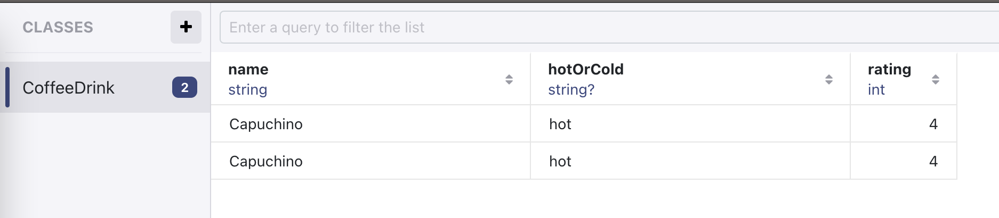
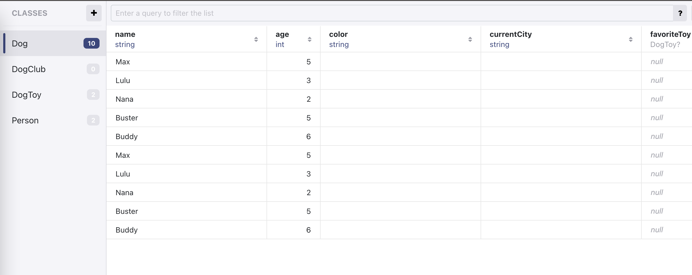
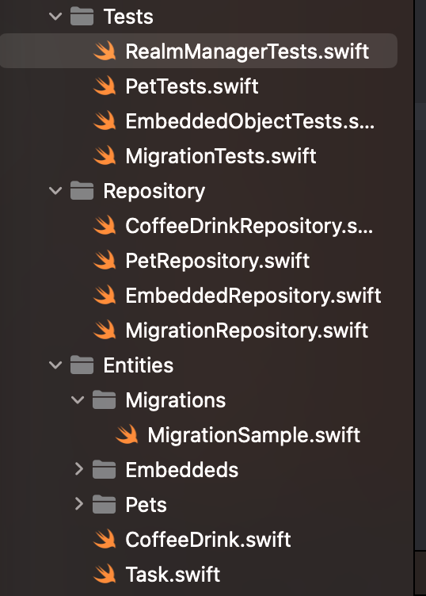

## Realm Manager for iOS

Microservices for RealmSwift. Split realms for easier management and migration:



```Swift
public protocol DatabaseConfigurable {
    var realmMemoryType: RealmMemoryType { get }

    // This property you must assign the database name that you want.
    //  If you want to use legacy architecture you can assign nil for it.
    //  If you want to use legacy architecture you can assign nil for it.
    var schemaName: String? { get }

    // This property you must assign the database version according to the migration count.
    // You must change the version on kLegacySchemaVersion instead according to the migration count too.
    //  If you want to use legacy architecture you can assign nil for it.
    var schemaVersion: UInt64? { get }

    // This property you must assign the table type to verify that this schema will use only this table.
    //  If you want to use legacy architecture you can assign nil for it.
    var objectTypes: [Object.Type]? { get }

    var embeddedObjectTypes: [EmbeddedObject.Type]? { get }

    // This property you must implement the migration logic if a table has changed.
    // If you want to use legacy architecture you can assign nil for it. If you assign nil.
    var migrationBlock: MigrationBlock? { get }
}
```


## Sample Projects

See QRealmManagerDemo and run test for reference samples.

## Installation
Pod:
```
pod 'QRealmManager'
```

Then import:

```Swift
import QRealmManager
```

Swift package:

```
https://github.com/lexuanquynh/QRealmManagerPackage.git
```
Then import:
```Swift
import QRealmManagerPackage
```

## Usage
- Create your entities. Examples:
```Swift
import RealmSwift

class CoffeeDrink: Object {
    @Persisted var name = ""
    @Persisted var hotOrCold: String?
    @Persisted var rating = 0
}
```

- Creating a repository to handle entity insertions, deletions, and queries:
```Swift
import RealmSwift

class CoffeeDrinkRepository: DatabaseConfigurable {
    var realmMemoryType: RealmMemoryType {
       return .inStorage
    }

    var schemaName: String? {
        return "CoffeeDrinkSchema"
    }

    var schemaVersion: UInt64? {
        0
    }

    var objectTypes: [Object.Type]? {
        return [CoffeeDrink.self]
    }

    var embeddedObjectTypes: [EmbeddedObject.Type]? {
        return nil
    }

    var migrationBlock: MigrationBlock? {
        return nil
    }
}
```

Run test:
```Swift
final class RealmManagerTests: XCTestCase {
    let repository = CoffeeDrinkRepository()

    func testSaveObjectNonPrimaryKey() throws {
        let coffeDrink = CoffeeDrink()
        coffeDrink.name = "Capuchino"
        coffeDrink.hotOrCold = "hot"
        coffeDrink.rating = 4
        let expectation = self.expectation(description: "Realm manager API")

        repository.save(entity: coffeDrink, update: false) { result in
            switch result {
            case .success:
                XCTAssertTrue(true)
                expectation.fulfill()
            case .failure:
                XCTAssertTrue(false)
                expectation.fulfill()
            }
        }
        self.waitForExpectations(timeout: 5.0, handler: nil)
    }

    // Query read more:
    // https://www.mongodb.com/docs/realm/sdk/swift/crud/filter-data/
}
```
### Simple entity:



### migration:

```Swift
lass MigrationRepository: DatabaseConfigurable {
    var realmMemoryType: RealmMemoryType {
        return .inStorage
    }

    var schemaName: String? {
        return "MigrationSchema"
    }

    var schemaVersion: UInt64? {
        1
    }

    var objectTypes: [Object.Type]? {
        return [MigrationSample.self]
    }

    var embeddedObjectTypes: [EmbeddedObject.Type]? {
        return nil
    }

    var migrationBlock: MigrationBlock? {
        let migrationBlock: MigrationBlock = { migration, oldSchemaVersion in
            if oldSchemaVersion < 1 {
                // Rename the "name" property to "yourName".
                // The renaming operation should be done outside of calls to `enumerateObjects(ofType: _:)`.
                migration.renameProperty(onType: MigrationSample.className(), from: "age", to: "yearsSinceBirth")
//                migration.renameProperty(onType: MigrationSample.className(), from: "name", to: "yourName")
            }

            // The enumerateObjects(ofType:_:) method iterates over
            // every Person object stored in the Realm file to apply the migration
            migration.enumerateObjects(ofType: MigrationSample.className()) { oldObject, newObject in
                // combine name fields into a single field
                let firstName = oldObject!["firstName"] as? String
                let lastName = oldObject!["lastName"] as? String
                newObject!["fullName"] = "\(firstName!) \(lastName!)"
            }
        }
        return migrationBlock
    }
}

```

### Embedded entity:


Code sample:

```Swift
class Address: EmbeddedObject {
    @Persisted var street: String?
    @Persisted var city: String?
    @Persisted var country: String?
    @Persisted var postalCode: String?
}
```

In your repository:

```Swift
class EmbeddedRepository: DatabaseConfigurable {
    var realmMemoryType: RealmMemoryType {
       return .inStorage
    }

    var schemaName: String? {
        return "EmbeddedSchema"
    }

    var schemaVersion: UInt64? {
        0
    }

    var objectTypes: [Object.Type]? {
        return [Contact.self]
    }

    var embeddedObjectTypes: [EmbeddedObject.Type]? {
        return [Address.self]
    }

    var migrationBlock: MigrationBlock? {
        return nil
    }
}
```

### Multi entities:




### All test cases:

[All test cases](QRealmManagerDemo/QRealmManagerDemoTests)



### License

[MIT LICENSE](License)