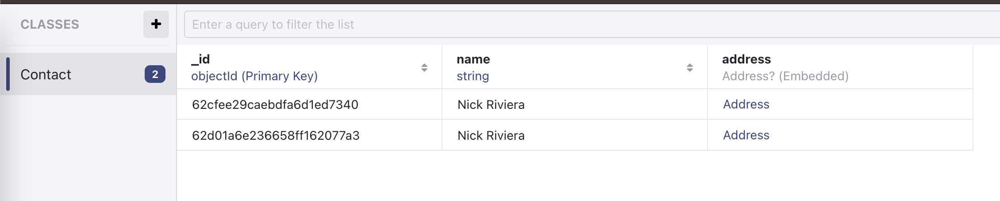

### Realm Manager for iOS

# QRealmManager

## Sample Projects
See QRealmManagerDemo and run test for reference samples.

## Installation
Pod:
```
pod 'QRealmManager'
```

## Usage
- Create your entities. Examples:
```Swift
import RealmSwift

class CoffeeDrink: Object {
    @Persisted var name = ""
    @Persisted var hotOrCold: String?
    @Persisted var rating = 0
}
```

- Creating a repository to handle entity insertions, deletions, and queries:
```Swift
import RealmSwift

class CoffeeDrinkRepository: DatabaseConfigurable {
    var realmMemoryType: RealmMemoryType {
       return .inStorage
    }

    var schemaName: String? {
        return "CoffeeDrinkSchema"
    }

    var schemaVersion: UInt64? {
        0
    }

    var objectTypes: [Object.Type]? {
        return [CoffeeDrink.self]
    }

    var embeddedObjectTypes: [EmbeddedObject.Type]? {
        return nil
    }

    var migrationBlock: MigrationBlock? {
        return nil
    }
}
```

Run test:
```Swift
final class RealmManagerTests: XCTestCase {
    let repository = CoffeeDrinkRepository()

    func testSaveObjectNonPrimaryKey() throws {
        let coffeDrink = CoffeeDrink()
        coffeDrink.name = "Capuchino"
        coffeDrink.hotOrCold = "hot"
        coffeDrink.rating = 4
        let expectation = self.expectation(description: "Realm manager API")

        repository.save(entity: coffeDrink, update: false) { result in
            switch result {
            case .success:
                XCTAssertTrue(true)
                expectation.fulfill()
            case .failure:
                XCTAssertTrue(false)
                expectation.fulfill()
            }
        }
        self.waitForExpectations(timeout: 5.0, handler: nil)
    }

    // Query read more:
    // https://www.mongodb.com/docs/realm/sdk/swift/crud/filter-data/
}
```
### Simple entity:


### Embedded entity entity:



### Multi entities:


### All test cases:

[All test cases](QRealmManagerDemo/QRealmManagerDemoTests)


### License

[MIT LICENSE](License)